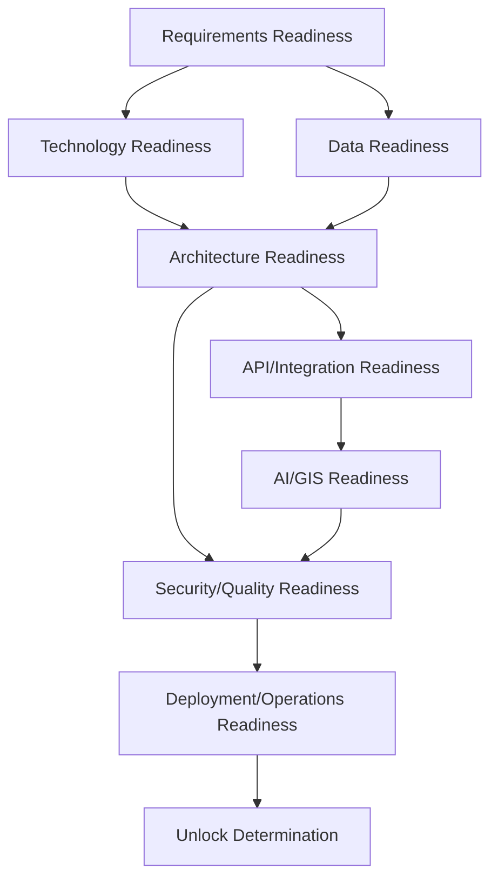

# Implementation Unlock Framework

## 1. Purpose

This document defines the complete transition from documentation to implementation, synthesizing the entire ED-M4/ED-M5 program into a single unlock framework. **This document does not declare DistrictMind implementation unlocked.**

## 2. The Eight-State Transition

| State | Meaning | DistrictMind's Current Position |
|---|---|---|
| Documentation | A design/requirement/process is fully specified | **Complete**, restated unchanged from [engineering-readiness-baseline.md](../16_Engineering_Readiness_and_Baseline/engineering-readiness-baseline.md) |
| Evidence | Facts have been gathered supporting a specific candidate, per [evidence-strategy.md](../18_Evidence_and_PoC_Resolution/evidence-strategy.md) | **Not collected** for any unresolved technology/data-source decision |
| Decision | A formal, reviewed Architecture Decision exists | 42 decisions exist, all Proposed except Git (Confirmed) |
| Baseline | The decision is recorded in [decision-register-baseline.md](../16_Engineering_Readiness_and_Baseline/decision-register-baseline.md) | Complete for all 42 existing decisions — but every CRITICAL/HIGH blocker remains un-decided, so nothing new has been baselined since ED-M4 Part 5 |
| Readiness | Every applicable Readiness Gate ([readiness-gate-framework.md](readiness-gate-framework.md)) passes | **Not achieved** — elaborated per-domain in Files 3–10 |
| Unlock | A formal determination that implementation may safely begin for a specific scope | **Not reached for any scope** |
| Implementation | Real engineering work (code, infrastructure) occurs | **Has not begun** |
| Validation | Implementation is verified against its originating requirements | Not applicable — nothing has been implemented |

## 3. Why Documentation Completion Alone Cannot Unlock Implementation

**Documentation establishes what should be built and how it should be structured — it does not establish that the specific technologies, datasets, and providers needed to build it actually exist, are accessible, or behave as required.** Restated unchanged from [engineering-readiness-baseline.md](../16_Engineering_Readiness_and_Baseline/engineering-readiness-baseline.md) Section 6's Documentation-Complete-vs-Implementation-Ready distinction, and [quality-assurance-and-release-readiness.md](../14_Testing_Security_Observability/quality-assurance-and-release-readiness.md) Section 4's identical governing principle: a complete architectural design for a system built on PostgreSQL, a specific frontend framework, and a specific AI provider is not itself evidence that PostgreSQL, that framework, and that provider are the right choices, or that a real Telangana boundary dataset exists to render. Six intermediate states (Evidence, Decision, Baseline, Readiness, Unlock, Validation) stand between Documentation and Implementation, and DistrictMind has only reliably reached the Documentation and (partial) Decision/Baseline states.

## 4. Unlock Prerequisites

| Prerequisite | Detail |
|---|---|
| Every applicable Readiness Gate passes | Per [readiness-gate-framework.md](readiness-gate-framework.md) — a gate's Pass Condition is met with real evidence, not assumption |
| No CRITICAL blocker remains unresolved for the scope being unlocked | Per [implementation-blockers.md](../16_Engineering_Readiness_and_Baseline/implementation-blockers.md) |
| Every relevant decision has reached at least Selected status with completed Validation Evidence | Per [decision-approval-and-status.md](../19_Decision_Records_and_Baseline/decision-approval-and-status.md) |
| The scope's dependencies (per [decision-management-framework.md](../19_Decision_Records_and_Baseline/decision-management-framework.md) Section 7) have themselves reached Unlock, not merely Baseline |

## 5. Blocking Conditions

| Condition | Effect |
|---|---|
| A CRITICAL blocker exists for the scope | Unlock cannot occur for that scope under any circumstance, regardless of how much else is ready |
| A non-negotiable architectural invariant is unverified for a candidate | The candidate's Decision cannot reach Selected, which blocks Unlock transitively |
| A dependency has not itself unlocked | Unlock is sequenced — a scope cannot unlock ahead of what it depends on |

## 6. Conditional Readiness

A scope may be **Conditionally Ready** where every gate passes except one carrying a named, tracked limitation (e.g., a boundary dataset covering only the Warangal pilot district rather than all 33, per [boundary-dataset-validation-plan.md](../18_Evidence_and_PoC_Resolution/boundary-dataset-validation-plan.md) Section 5) — Conditional Readiness may support a narrowly scoped Unlock (e.g., unlocking the pilot-district vertical slice) while the full scope remains blocked.

## 7. Partial Readiness

Partial Readiness describes a scope where some but not all gates pass, with no accepted condition bridging the gap — restated distinct from Conditional Readiness: Partial Readiness does not support any Unlock, since the gap is not yet tracked/accepted as a bounded, known limitation.

## 8. Dependency Ordering

Unlock is never granted for a downstream area (e.g., AI/GIS) while an upstream dependency (e.g., core Technology Readiness) remains unresolved — restated consistent with [milestone-readiness-matrix.md](../16_Engineering_Readiness_and_Baseline/milestone-readiness-matrix.md) Section 9's identical dependency-bounding principle for M1–M6.

## 9. Evidence Requirements

Every Unlock determination cites the specific Evidence and Decision records it rests on ([decision-evidence-record.md](../18_Evidence_and_PoC_Resolution/decision-evidence-record.md)) — restated unchanged from [decision-evidence-requirements.md](../19_Decision_Records_and_Baseline/decision-evidence-requirements.md); an Unlock determination made without citable evidence is itself a process violation.

## 10. Approval Concept

An Unlock determination requires an explicit approval action distinct from any individual gate's pass — restated consistent with [decision-approval-and-status.md](../19_Decision_Records_and_Baseline/decision-approval-and-status.md) Section 5's Decision Approver role concept, extended here: an "Implementation Unlock Approver" conceptual role (never a named individual) formally records that a scope's full set of applicable gates has passed and its dependencies are themselves unlocked.

## 11. Rollback Considerations

An Unlock, once granted, may be revoked if subsequent evidence undermines a gate that previously passed (e.g., an implementation-time discovery that a Selected technology violates a non-negotiable invariant) — restated consistent with [technology-baseline-management.md](../19_Decision_Records_and_Baseline/technology-baseline-management.md) Section 6's Rollback/Replacement discipline; an Unlock is a current-state determination, not an irrevocable guarantee.

## 12. DistrictMind Is Not Implementation Unlocked

**As of this milestone, no scope of DistrictMind — not even the narrowest pilot-district vertical slice — has passed through Unlock.** Every CRITICAL blocker in [implementation-blockers.md](../16_Engineering_Readiness_and_Baseline/implementation-blockers.md) remains unresolved, and no PoC in [proof-of-concept-framework.md](../18_Evidence_and_PoC_Resolution/proof-of-concept-framework.md) or its per-domain applications has been executed. This document defines the mechanism by which Unlock would eventually be determined; it does not itself grant one.

## 13. Security

Every state transition (Section 2) requires security evidence per [decision-evidence-requirements.md](../19_Decision_Records_and_Baseline/decision-evidence-requirements.md) Section 4 before advancing — no scope reaches Unlock while carrying an unresolved security-boundary risk.

## 14. Observability

Every Unlock determination, once made, is recorded and auditable alongside the decisions and gates it rests on.

## 15. Milestone Traceability

This framework governs the transition to implementation for every M1–M6 milestone, with M1's vertical slice as the necessarily first-attempted scope per AD-IMP-001.

## 16. Open Decisions

None introduced — this document defines the unlock mechanism; it grants no unlock and resolves no blocker.
