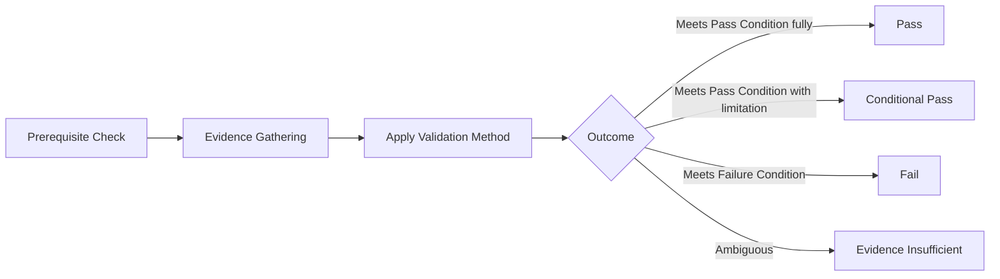

# Readiness Gate Framework

## 1. Purpose

This document defines the reusable readiness-gate structure used by every domain-specific gate document in this milestone (Files 3–10). **No numeric threshold is invented anywhere in this framework.**

## 2. The Standard Gate Structure

| Field | Detail |
|---|---|
| Gate ID | A unique, human-readable identifier (e.g., `RG-DATA-001`) — distinct from and never confused with an `AD-*` Architecture Decision ID |
| Purpose | What this gate verifies, in one or two sentences |
| Prerequisite | What must already be true before this gate can even be evaluated |
| Evidence required | Which evidence categories ([decision-evidence-requirements.md](../19_Decision_Records_and_Baseline/decision-evidence-requirements.md)) this gate draws on |
| Validation method | How the evidence is checked — document review, PoC result review, independent Decision Review ([decision-review-process.md](../19_Decision_Records_and_Baseline/decision-review-process.md)) |
| Pass condition | The qualitative state that constitutes passing — never a numeric threshold |
| Failure condition | The qualitative state that constitutes failing |
| Blocker severity | CRITICAL / HIGH / MEDIUM / LOW, per [implementation-blockers.md](../16_Engineering_Readiness_and_Baseline/implementation-blockers.md) Section 2's classification method |
| Dependent areas | Which other gates or components depend on this one passing first |
| Affected milestones | Which M1–M6 milestone(s) this gate applies to |
| Owner role concept | A conceptual role (never a named individual) responsible for evaluating this gate |
| Status | The gate's current evaluation outcome — Not Yet Evaluated / Evidence Insufficient / Fail / Conditional Pass / Pass |

## 3. Gate ID Namespace

Gate IDs use the prefix `RG-<DOMAIN>-<NNN>` (Readiness Gate) — e.g., `RG-DATA-001`, `RG-TECH-003`, `RG-AI-002` — deliberately distinct from the `AD-*` decision-ID namespace, so a gate (a checkpoint) is never mistaken for a decision (a recorded choice). A gate references the decisions relevant to it; it does not itself constitute one.

## 4. Gate Status Vocabulary

| Status | Meaning |
|---|---|
| Not Yet Evaluated | No evidence has been gathered against this gate |
| Evidence Insufficient | Evidence-gathering was attempted but did not reach a conclusive finding — restated consistent with [decision-evidence-requirements.md](../19_Decision_Records_and_Baseline/decision-evidence-requirements.md) Section 3's "Insufficient Evidence" tier |
| Fail | The gate's Failure Condition is met — a non-negotiable requirement is violated, or no viable candidate exists |
| Conditional Pass | The gate's Pass Condition is met with a named, tracked limitation (restated consistent with [implementation-unlock-framework.md](implementation-unlock-framework.md) Section 6) |
| Pass | The gate's Pass Condition is fully met with no outstanding limitation |

**As of this milestone, every gate defined in Files 3–10 carries the status "Not Yet Evaluated," except where a prior milestone's own findings already establish a Fail or Evidence Insufficient status (e.g., the boundary dataset gate, which is already known to fail its Prerequisite since no candidate dataset has even been identified).**

## 5. Qualitative Pass Conditions — No Numeric Threshold

Every gate's Pass Condition is expressed as a qualitative state ("the candidate's evidence confirms compatibility with the modular monolith") rather than a number ("the candidate scores above N points") — restated unchanged from [engineering-quality-gates.md](../08_Implementation_Foundation/engineering-quality-gates.md) AD-IMP-005's qualitative-gate discipline and [decision-evidence-requirements.md](../19_Decision_Records_and_Baseline/decision-evidence-requirements.md) Section 6's identical refusal to invent a numeric sufficiency count.

## 6. Blocker Severity Mapping

Restated unchanged from [implementation-blockers.md](../16_Engineering_Readiness_and_Baseline/implementation-blockers.md) Section 2:

| Severity | Criterion |
|---|---|
| CRITICAL | Blocks the earliest possible M1 vertical slice; no preparatory work possible without it |
| HIGH | Blocks a specific milestone but does not prevent earlier milestones' work |
| MEDIUM | Constrains scope/quality without preventing implementation from beginning |
| LOW | A documentation-completeness or calibration gap with no direct blocking effect |

## 7. Relationship to the Ten Engineering Quality Gates

This framework's per-domain readiness gates (Files 3–10) are distinct from, but complementary to, the Ten Engineering Quality Gates (AD-IMP-005, [engineering-quality-gates.md](../08_Implementation_Foundation/engineering-quality-gates.md)): the Ten Gates verify a specific implementation milestone's *exit criteria* once implementation has begun; this framework's Readiness Gates verify whether implementation should *begin at all* for a given scope. A Readiness Gate passing is a prerequisite for entering Gate 1 of the Ten Gates, not a replacement for it.

## 8. Gate Evaluation Sequence

## 9. Gate Independence from Decision Status

A gate can reference a decision at any status (Candidate through Selected) in its evidence, but a gate's own Pass status requires the referenced decision to have reached at least Selected with completed Validation Evidence — restated consistent with [decision-approval-and-status.md](../19_Decision_Records_and_Baseline/decision-approval-and-status.md) Section 7's "baseline-worthy" criteria, extended here to gate evaluation specifically.

## 10. No Gate Currently Passes

**Every gate defined across Files 3–10 of this milestone is recorded with status Not Yet Evaluated or, where a prior milestone's findings already conclusively establish a blocking fact, Fail.** No gate is marked Pass or Conditional Pass anywhere in this milestone, since no PoC has been executed and no decision has advanced beyond its pre-existing status.

## 11. Security

Every gate's Evidence Required field explicitly includes Security evidence where applicable, restated unchanged from [decision-evidence-requirements.md](../19_Decision_Records_and_Baseline/decision-evidence-requirements.md) Section 4.

## 12. Observability

Every gate evaluation, once it occurs, is recorded and auditable, feeding [implementation-unlock-matrix.md](implementation-unlock-matrix.md)'s master view.

## 13. Milestone Traceability

This framework applies to every readiness gate across all M1–M6 milestones.

## 14. Open Decisions

None introduced — this document defines gate structure; it evaluates no actual candidate.
