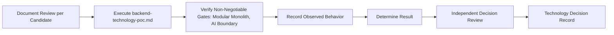

# Backend Decision Evidence Plan

## 1. Purpose

This document defines the evidence required to resolve backend technology, elaborating [backend-technology-evaluation.md](../17_Data_and_Technology_Resolution/backend-technology-evaluation.md) and [backend-technology-poc.md](../18_Evidence_and_PoC_Resolution/backend-technology-poc.md) into an acquisition-focused plan. **No backend framework is selected.**

## 2. Candidates — Restated Unchanged

| Technology | Status | Source |
|---|---|---|
| FastAPI (Python) | Candidate | [technology-stack.md](../00_Engineering_Overview/technology-stack.md) |
| Node.js (Express/NestJS) | Candidate | Same |
| Django | Candidate | Same |

## 3. Evidence Categories and Acquisition Approach

| Category | What Evidence Would Show | Acquisition Approach | Current Status |
|---|---|---|---|
| API requirements | The candidate supports REST + OpenAPI (AD-BE-002) cleanly for all 18 operations | Execute [backend-technology-poc.md](../18_Evidence_and_PoC_Resolution/backend-technology-poc.md) Section 3's routing scenario | **EVIDENCE NOT AVAILABLE** |
| Modular-monolith fit | The candidate expresses Application Services/Domain Logic/Repository as internal module boundaries within one deployable unit (AD-BE-001) | Execute the PoC's Section 4 non-negotiable gate | **EVIDENCE NOT AVAILABLE** |
| Validation | The candidate supports structural (400) vs. semantic (422) distinction (AD-BE-006) | Execute the PoC's validation scenario | **EVIDENCE NOT AVAILABLE** |
| Authentication | The candidate rejects unauthenticated requests correctly | Execute the PoC's authentication-boundary scenario | **EVIDENCE NOT AVAILABLE** |
| Authorization | The candidate enforces district/role scope identically for ordinary and AI-originated requests | Execute the PoC's authorization-boundary scenario | **EVIDENCE NOT AVAILABLE** |
| Database integration | The candidate integrates cleanly with the Repository layer's local-ACID-only transaction model (AD-BE-005) | Execute the PoC's repository-integration scenario | **EVIDENCE NOT AVAILABLE** |
| GIS integration | The candidate correctly invokes a stubbed GIS Service without performing computation itself | Execute the PoC's GIS-integration scenario | **EVIDENCE NOT AVAILABLE** |
| AI integration | The candidate correctly dispatches stubbed Typed Tool calls with no bypass path (AD-DE-005) | Execute the PoC's Section 5 non-negotiable gate | **EVIDENCE NOT AVAILABLE** |
| Background jobs | The candidate supports async execution per the four-criterion test (AD-BE-004) | Execute the PoC's background-jobs scenario | **EVIDENCE NOT AVAILABLE** |
| Observability | The candidate's ecosystem supports correlation-ID propagation through a simulated multi-step plan | Execute the PoC's observability scenario | **EVIDENCE NOT AVAILABLE** |
| Testing | The candidate's ecosystem supports unit/integration/API-level testing without unusual workarounds | Document review + PoC testability assessment | **EVIDENCE NOT AVAILABLE** |
| Deployment | The candidate packages cleanly per [application-packaging.md](../15_Deployment_Infrastructure_Operations/application-packaging.md) Section 4 | Document review + packaging trial | **EVIDENCE NOT AVAILABLE** |

## 4. Evidence Acquisition Sequence

**None of these steps has occurred.**

## 5. Non-Negotiable Gates — Restated

**A candidate that cannot cleanly express the modular monolith (Section 3, "Modular-monolith fit") or that provides any bypass around the Typed Tool → Authorization → Application Service → Repository chain (Section 3, "AI integration") fails this evidence process outright, regardless of performance elsewhere** — restated unchanged from [backend-technology-poc.md](../18_Evidence_and_PoC_Resolution/backend-technology-poc.md) Sections 4–5.

## 6. No Framework Selected

**This document selects no backend technology.** FastAPI, Node.js (Express/NestJS), and Django remain exactly as Candidate as recorded in [technology-stack.md](../00_Engineering_Overview/technology-stack.md).

## 7. Security

Sections 3's Authorization and AI-integration rows are this document's central security evidence — both remain untested pending PoC execution.

## 8. Observability

Once evidence acquisition genuinely begins, every finding is recorded per [evidence-record-management.md](evidence-record-management.md).

## 9. Milestone Traceability

| Evidence Item | First Needed |
|---|---|
| Backend technology resolution | M1 |

## 10. Open Decisions

No backend technology is selected. All evidence categories in Section 3 report EVIDENCE NOT AVAILABLE.
