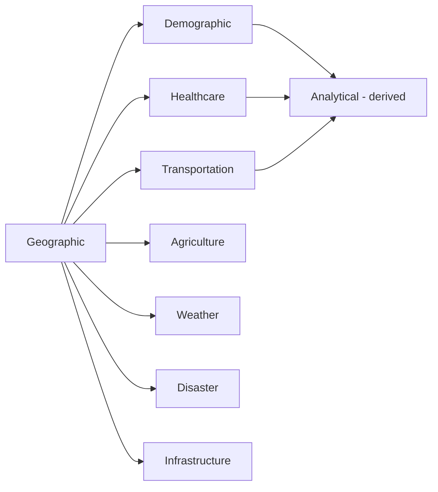

# Data Source Evidence Plan

## 1. Purpose

This document defines the process for identifying and validating real data sources for every DistrictMind domain, elaborating [data-source-validation-plan.md](../18_Evidence_and_PoC_Resolution/data-source-validation-plan.md) into an acquisition-focused plan. **No source is claimed confirmed anywhere in this document — every domain reports EVIDENCE NOT AVAILABLE.**

## 2. The Eleven Evidence Dimensions — Applied Per Domain

Restated unchanged from [data-source-evaluation-framework.md](../17_Data_and_Technology_Resolution/data-source-evaluation-framework.md) Section 2: Authority, Provenance, Spatial Coverage, Temporal Coverage, Identifiers, Schema, Freshness, Accessibility, Licensing, Quality, Reproducibility.

## 3. Geographic

| Dimension | Evidence Acquisition Approach | Current Status |
|---|---|---|
| Authority | Identify the administrative body responsible for Telangana district/mandal/village boundaries | EVIDENCE NOT AVAILABLE |
| Provenance | Confirm origin/chain of custody for any candidate boundary file | EVIDENCE NOT AVAILABLE |
| Spatial coverage | Confirm all 33 districts (or minimally the pilot district) are covered | EVIDENCE NOT AVAILABLE |
| Temporal coverage | Confirm the boundary reflects current administrative divisions | EVIDENCE NOT AVAILABLE |
| Identifiers | Confirm stable per-district identifiers exist | EVIDENCE NOT AVAILABLE |
| Schema | Confirm attribute schema (name, code, area) | EVIDENCE NOT AVAILABLE |
| Freshness | Confirm update cadence for administrative reorganization | EVIDENCE NOT AVAILABLE |
| Accessibility | Confirm a documented, repeatable acquisition process | EVIDENCE NOT AVAILABLE |
| Licensing | Confirm redistribution rights for frontend rendering | EVIDENCE NOT AVAILABLE |
| Quality | Confirm no gaps/overlaps between adjacent units | EVIDENCE NOT AVAILABLE |
| Reproducibility | Confirm repeated extraction yields consistent results | EVIDENCE NOT AVAILABLE |

Elaborated further in [boundary-dataset-evidence-plan.md](boundary-dataset-evidence-plan.md).

## 4. Demographic

| Dimension | Evidence Acquisition Approach | Current Status |
|---|---|---|
| Authority | Identify the census/statistical authority for Telangana | EVIDENCE NOT AVAILABLE |
| Provenance | Confirm methodology disclosure | EVIDENCE NOT AVAILABLE |
| Spatial coverage | Confirm coverage at Village/Mandal/District granularity | EVIDENCE NOT AVAILABLE |
| Temporal coverage | Confirm census cadence and any inter-census growth estimates | EVIDENCE NOT AVAILABLE |
| Identifiers | Confirm anchoring to the Geography hierarchy, not independent geocoding | EVIDENCE NOT AVAILABLE |
| Schema | Confirm population-count field definitions | EVIDENCE NOT AVAILABLE |
| Freshness | Confirm currency relative to the most recent census/estimate | EVIDENCE NOT AVAILABLE |
| Accessibility | Confirm acquisition process | EVIDENCE NOT AVAILABLE |
| Licensing | Confirm permission for derived computation without violating privacy constraints (Potentially Sensitive classification) | EVIDENCE NOT AVAILABLE |
| Quality | Confirm internal consistency | EVIDENCE NOT AVAILABLE |
| Reproducibility | Confirm consistent re-extraction | EVIDENCE NOT AVAILABLE |

## 5. Healthcare

| Dimension | Evidence Acquisition Approach | Current Status |
|---|---|---|
| Authority | Identify the health department/facility registry authority | EVIDENCE NOT AVAILABLE |
| Provenance | Confirm origin of facility records | EVIDENCE NOT AVAILABLE |
| Spatial coverage | Confirm facility point coverage across the target district(s) | EVIDENCE NOT AVAILABLE |
| Temporal coverage | Confirm facility opening/closure currency | EVIDENCE NOT AVAILABLE |
| Identifiers | Confirm stable facility identifiers | EVIDENCE NOT AVAILABLE |
| Schema | Confirm facility-type taxonomy | EVIDENCE NOT AVAILABLE |
| Freshness | Confirm update cadence | EVIDENCE NOT AVAILABLE |
| Accessibility | Confirm acquisition process | EVIDENCE NOT AVAILABLE |
| Licensing | Confirm permission for public-facing display | EVIDENCE NOT AVAILABLE |
| Quality | Confirm no duplicate facility records | EVIDENCE NOT AVAILABLE |
| Reproducibility | Confirm consistent re-extraction | EVIDENCE NOT AVAILABLE |

## 6. Transportation

| Dimension | Evidence Acquisition Approach | Current Status |
|---|---|---|
| Authority | Identify the road-network authority or an equivalent maintained community source | EVIDENCE NOT AVAILABLE |
| Provenance | Confirm origin | EVIDENCE NOT AVAILABLE |
| Spatial coverage | Confirm road network coverage of the target district(s) | EVIDENCE NOT AVAILABLE |
| Temporal coverage | Confirm currency of road closures/changes | EVIDENCE NOT AVAILABLE |
| Identifiers | Confirm stable road-segment identifiers | EVIDENCE NOT AVAILABLE |
| Schema | Confirm road-class taxonomy | EVIDENCE NOT AVAILABLE |
| Freshness | Confirm update cadence | EVIDENCE NOT AVAILABLE |
| Accessibility | Confirm acquisition process | EVIDENCE NOT AVAILABLE |
| Licensing | Confirm permission for routing computation and redistribution | EVIDENCE NOT AVAILABLE |
| Quality | Confirm network connectivity — no unexplained disconnected segments | EVIDENCE NOT AVAILABLE |
| Reproducibility | Confirm consistent re-extraction | EVIDENCE NOT AVAILABLE |

## 7. Agriculture

| Dimension | Evidence Acquisition Approach | Current Status |
|---|---|---|
| Authority | Identify the agriculture department/statistical authority | EVIDENCE NOT AVAILABLE |
| Provenance | Confirm origin | EVIDENCE NOT AVAILABLE |
| Spatial coverage | Confirm field/mandal-level coverage | EVIDENCE NOT AVAILABLE |
| Temporal coverage | Confirm seasonal cadence | EVIDENCE NOT AVAILABLE |
| Identifiers | Confirm consistent regional identifiers | EVIDENCE NOT AVAILABLE |
| Schema | Confirm crop/season taxonomy | EVIDENCE NOT AVAILABLE |
| Freshness | Confirm seasonal update cadence | EVIDENCE NOT AVAILABLE |
| Accessibility | Confirm acquisition process | EVIDENCE NOT AVAILABLE |
| Licensing | Confirm permission for ingestion and derived analytics | EVIDENCE NOT AVAILABLE |
| Quality | Confirm consistent unit reporting | EVIDENCE NOT AVAILABLE |
| Reproducibility | Confirm consistent re-extraction | EVIDENCE NOT AVAILABLE |

## 8. Weather/Environment

| Dimension | Evidence Acquisition Approach | Current Status |
|---|---|---|
| Authority | Identify the meteorological authority | EVIDENCE NOT AVAILABLE |
| Provenance | Confirm station-level origin | EVIDENCE NOT AVAILABLE |
| Spatial coverage | Confirm station density sufficient for meaningful aggregation | EVIDENCE NOT AVAILABLE |
| Temporal coverage | Confirm observation frequency | EVIDENCE NOT AVAILABLE |
| Identifiers | Confirm stable station identifiers | EVIDENCE NOT AVAILABLE |
| Schema | Confirm consistent units/methodology across stations | EVIDENCE NOT AVAILABLE |
| Freshness | Confirm near-current observation availability | EVIDENCE NOT AVAILABLE |
| Accessibility | Confirm acquisition process | EVIDENCE NOT AVAILABLE |
| Licensing | Confirm permission for ingestion and derived computation | EVIDENCE NOT AVAILABLE |
| Quality | Confirm outlier/sensor-error detectability | EVIDENCE NOT AVAILABLE |
| Reproducibility | Confirm consistent re-extraction | EVIDENCE NOT AVAILABLE |

## 9. Disaster

| Dimension | Evidence Acquisition Approach | Current Status |
|---|---|---|
| Authority | Identify the disaster-management authority | EVIDENCE NOT AVAILABLE |
| Provenance | Confirm event-record origin | EVIDENCE NOT AVAILABLE |
| Spatial coverage | Confirm affected-area geometry coverage | EVIDENCE NOT AVAILABLE |
| Temporal coverage | Confirm event timing/duration disclosure | EVIDENCE NOT AVAILABLE |
| Identifiers | Confirm stable event identifiers | EVIDENCE NOT AVAILABLE |
| Schema | Confirm severity/risk classification consistency | EVIDENCE NOT AVAILABLE |
| Freshness | Confirm time-critical currency | EVIDENCE NOT AVAILABLE |
| Accessibility | Confirm acquisition process | EVIDENCE NOT AVAILABLE |
| Licensing | Confirm permission for public-facing disclosure | EVIDENCE NOT AVAILABLE |
| Quality | Confirm consistent classification across events | EVIDENCE NOT AVAILABLE |
| Reproducibility | Confirm consistent re-extraction | EVIDENCE NOT AVAILABLE |

## 10. Infrastructure

| Dimension | Evidence Acquisition Approach | Current Status |
|---|---|---|
| Authority | Identify the infrastructure/asset-registry authority | EVIDENCE NOT AVAILABLE |
| Provenance | Confirm asset-record origin | EVIDENCE NOT AVAILABLE |
| Spatial coverage | Confirm point/area geometry coverage | EVIDENCE NOT AVAILABLE |
| Temporal coverage | Confirm currency | EVIDENCE NOT AVAILABLE |
| Identifiers | Confirm stable asset identifiers | EVIDENCE NOT AVAILABLE |
| Schema | Confirm asset-type taxonomy | EVIDENCE NOT AVAILABLE |
| Freshness | Confirm update cadence | EVIDENCE NOT AVAILABLE |
| Accessibility | Confirm acquisition process | EVIDENCE NOT AVAILABLE |
| Licensing | Confirm permission for public-facing disclosure | EVIDENCE NOT AVAILABLE |
| Quality | Confirm deduplication | EVIDENCE NOT AVAILABLE |
| Reproducibility | Confirm consistent re-extraction | EVIDENCE NOT AVAILABLE |

## 11. Analytical Data

| Dimension | Evidence Acquisition Approach | Current Status |
|---|---|---|
| Authority | N/A — Analytical data is Derived, computed internally from Curated data per the seven-layer flow, not independently sourced | N/A |
| Provenance | Confirmed via the computation lineage from Curated inputs, once those exist | Blocked by all domains above |
| All other dimensions | Inherited from the Curated data they derive from | Blocked |

**Analytical data has no independent source-acquisition requirement — its evidence question is entirely downstream of the domains in Sections 3–10.**

## 12. AI/Agent Data

| Dimension | Evidence Acquisition Approach | Current Status |
|---|---|---|
| Authority | N/A — AI Response is never a data source; it is generated from Evidence, per the six-category model | N/A |
| All other dimensions | Not applicable — AI/Agent output is explicitly excluded from the data-source acquisition process, since it is never treated as Source of Truth | N/A |

**AI/Agent data is not a data-source acquisition target — restated unchanged from every prior milestone's rule that AI Response is not authoritative source data.**

## 13. Acquisition Sequencing

Geographic data is acquired first, since every other domain's spatial reference depends on the Geography hierarchy — restated unchanged from [data-source-requirements.md](../17_Data_and_Technology_Resolution/data-source-requirements.md) Section 3's foundational role, and consistent with AD-IMP-001's risk-first vertical-slice strategy prioritizing the pilot district.

## 14. No Source Claimed Confirmed

**Every domain in Sections 3–10 reports EVIDENCE NOT AVAILABLE for every one of the eleven evidence dimensions.** No source name, provider, or dataset is introduced anywhere in this document beyond the generic domain-authority concepts already established in [data-source-requirements.md](../17_Data_and_Technology_Resolution/data-source-requirements.md).

## 15. Security

Every domain's Licensing evidence explicitly gates whether ingestion is even legally possible before any other dimension is meaningfully evaluated — restated unchanged from [data-source-decision-record-standard.md](../19_Decision_Records_and_Baseline/data-source-decision-record-standard.md) Section 5.

## 16. Observability

Once any domain's evidence acquisition genuinely begins, it is recorded per [evidence-record-management.md](evidence-record-management.md).

## 17. Milestone Traceability

| Domain | First Needed |
|---|---|
| Geographic | M1 |
| Healthcare, Transportation, Weather, Disaster, Agriculture, Infrastructure, Demographic | M2 |
| Analytical | M2 (derived from Curated) |
| AI/Agent | Not applicable as a source-acquisition target |

## 18. Open Decisions

Every domain remains SOURCE UNRESOLVED. No provider is confirmed anywhere in this document.
