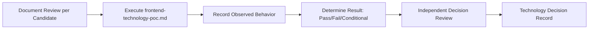

# Frontend Decision Evidence Plan

## 1. Purpose

This document defines the actual evidence required to resolve frontend technology, elaborating [frontend-technology-evaluation.md](../17_Data_and_Technology_Resolution/frontend-technology-evaluation.md) and [frontend-technology-poc.md](../18_Evidence_and_PoC_Resolution/frontend-technology-poc.md) into an acquisition-focused plan. **No framework is selected. Candidates evaluated are only those already documented.**

## 2. Candidates — Restated Unchanged

| Technology | Status | Source |
|---|---|---|
| React | Proposed | [technology-stack.md](../00_Engineering_Overview/technology-stack.md) |
| Next.js | Candidate | Same |
| Vue.js | Candidate | Same |
| TypeScript | Proposed | Same |

## 3. Evidence Categories and Acquisition Approach

| Category | What Evidence Would Show | Acquisition Approach | Current Status |
|---|---|---|---|
| Requirements fit | The candidate supports SPA shell, routing (`/districts/:id`), component architecture, state management per AD-FE-001–003 | Execute [frontend-technology-poc.md](../18_Evidence_and_PoC_Resolution/frontend-technology-poc.md) Sections 3–4 against each candidate | **EVIDENCE NOT AVAILABLE — no PoC executed** |
| GIS compatibility | The candidate integrates with a rendering library (Leaflet/Mapbox GL JS) while respecting render-only boundary (AD-FE-004) | Execute the PoC's GIS rendering scenario | **EVIDENCE NOT AVAILABLE** |
| Animation capability | The candidate sustains smooth, polished animation (AD-FE-006) without stutter, including under concurrent GIS/AI load | Execute the PoC's Section 4 concurrent-load scenario | **EVIDENCE NOT AVAILABLE** |
| Accessibility | The candidate supports keyboard navigation and screen-reader landmark structure | Execute the PoC's accessibility scenario | **EVIDENCE NOT AVAILABLE** |
| Performance | The candidate sustains responsiveness per NFR-035's Initial Target (30 fps, To Be Validated) | Execute the PoC's performance scenario | **EVIDENCE NOT AVAILABLE** |
| API integration | The candidate cleanly consumes the existing 18 API operations | Execute the PoC against stubbed API responses | **EVIDENCE NOT AVAILABLE** |
| Maintainability | The candidate's component architecture remains comprehensible at DistrictMind's scale | Qualitative reviewer assessment during PoC | **EVIDENCE NOT AVAILABLE** |
| Ecosystem | The candidate's library/tooling maturity is adequate | Document review of candidate's official ecosystem | **EVIDENCE NOT AVAILABLE — not yet reviewed** |
| Deployment compatibility | The candidate packages cleanly per [application-packaging.md](../15_Deployment_Infrastructure_Operations/application-packaging.md) Section 3 | Document review + packaging trial | **EVIDENCE NOT AVAILABLE** |

## 4. Evidence Acquisition Sequence

**None of these steps has occurred.** This document defines the sequence; it does not execute it.

## 5. The Polished, Smooth, Animation-Rich UI Requirement — Explicit Evidence Focus

**This requirement is the single most DistrictMind-specific evidence dimension for this decision**, restated unchanged from [frontend-technology-poc.md](../18_Evidence_and_PoC_Resolution/frontend-technology-poc.md) Section 4. Future evidence must specifically demonstrate — not merely claim — that a candidate can sustain smooth animation while:

1. The GIS map renders and updates (level-of-detail transitions, pan/zoom).
2. A simulated long-running AI response is pending.
3. Dashboard indicators update.

**No candidate has been tested against this combined scenario. No claim is made here that any candidate satisfies or fails this requirement.**

## 6. No Framework Selected

**This document selects no frontend technology.** React, Next.js, Vue.js, and TypeScript remain exactly as Proposed/Candidate as recorded in [technology-stack.md](../00_Engineering_Overview/technology-stack.md).

## 7. Security

Evidence acquisition must confirm no candidate requires embedding a secret in the frontend artifact — restated unchanged from [configuration-and-secrets-operations.md](../15_Deployment_Infrastructure_Operations/configuration-and-secrets-operations.md) Section 11; this remains an untested assumption pending PoC execution.

## 8. Observability

Once evidence acquisition genuinely begins, every finding is recorded per [evidence-record-management.md](evidence-record-management.md).

## 9. Milestone Traceability

| Evidence Item | First Needed |
|---|---|
| Frontend technology resolution | M1 |

## 10. Open Decisions

No frontend technology is selected. All evidence categories in Section 3 report EVIDENCE NOT AVAILABLE.
