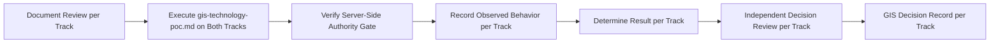

# GIS Decision Evidence Plan

## 1. Purpose

This document defines the evidence required for GIS technology, elaborating [gis-technology-evaluation.md](../17_Data_and_Technology_Resolution/gis-technology-evaluation.md) and [gis-technology-poc.md](../18_Evidence_and_PoC_Resolution/gis-technology-poc.md) into an acquisition-focused plan. **No GIS library is selected.**

## 2. Candidates — Restated Unchanged, Two Tracks

| Track | Technology | Status |
|---|---|---|
| Server-side computation | PostGIS | Candidate |
| Server-side computation | GeoServer | To Be Evaluated |
| Frontend rendering | Leaflet | Candidate |
| Frontend rendering | Mapbox GL JS | Candidate |

## 3. Evidence Categories and Acquisition Approach

| Category | What Evidence Would Show | Acquisition Approach | Current Status |
|---|---|---|---|
| GIS technology (general fit) | Candidate satisfies the bounded operation set ([typed-tool-implementation.md](../13_AI_Intelligence_Implementation/typed-tool-implementation.md) Section 8.2) | Document review + PoC | **EVIDENCE NOT AVAILABLE** |
| Spatial database capability | The server-side candidate correctly stores/queries geometry as an extension of the primary store (AD-DB-001) | Execute [gis-technology-poc.md](../18_Evidence_and_PoC_Resolution/gis-technology-poc.md) Section 4 scenarios | **EVIDENCE NOT AVAILABLE** |
| Geometry processing | Structural validity checks correctly reject malformed test geometry | Execute the PoC's geometry-validation scenario | **EVIDENCE NOT AVAILABLE** |
| CRS handling | A geometry ingested under a disclosed CRS transforms correctly to the working CRS with no undocumented distortion | Execute the PoC's coordinate-transformation scenario | **EVIDENCE NOT AVAILABLE** |
| Spatial joins | A Population Observation correctly resolves to its Village's geometry via stable identifier | Execute the PoC's spatial-joins scenario | **EVIDENCE NOT AVAILABLE** |
| 10 km coverage | Buffer + containment computation matches an independently verified expected result (Example A) | Execute the PoC's coverage scenario | **EVIDENCE NOT AVAILABLE** |
| Bridge closure analysis | Sandboxed network-impact recomputation matches expected result (Example B) | Execute the PoC's network-behavior scenario | **EVIDENCE NOT AVAILABLE** |
| Rainfall/disaster analysis | Spatial aggregation and affected-area intersection produce correct multi-stage results (Example C) | Execute the PoC's rainfall-impact scenario | **EVIDENCE NOT AVAILABLE** |
| Server-side authority | No client-side computation path exists anywhere in the candidate combination | Execute the PoC's Section 5 non-negotiable gate | **EVIDENCE NOT AVAILABLE** |
| Frontend rendering | The rendering-track candidate correctly displays server-computed geometry at each level-of-detail tier (AD-GIS-001) | Execute the PoC's rendering-track scenarios | **EVIDENCE NOT AVAILABLE** |

## 4. The Two Tracks Are Never Merged — Restated

Restated unchanged from [gis-technology-poc.md](../18_Evidence_and_PoC_Resolution/gis-technology-poc.md) Section 2 and AD-FE-004: rendering-track evidence (Leaflet/Mapbox GL JS) and computation-track evidence (PostGIS/GeoServer) are gathered, evaluated, and decided independently. **No rendering candidate is ever credited with spatial computation capability, and no computation candidate is evaluated on rendering quality.**

## 5. Evidence Acquisition Sequence

**None of these steps has occurred, on either track.**

## 6. Non-Negotiable Gate — Restated

**A candidate combination containing any client-side authoritative spatial computation path fails this evidence process outright**, restated unchanged from AD-FE-004 and [gis-technology-poc.md](../18_Evidence_and_PoC_Resolution/gis-technology-poc.md) Section 5.

## 7. Coupling to the Database Decision

The server-side computation track's evidence is partly coupled to [database-decision-evidence-plan.md](database-decision-evidence-plan.md), since PostGIS specifically depends on PostgreSQL — restated unchanged from [database-technology-evaluation.md](../17_Data_and_Technology_Resolution/database-technology-evaluation.md) Section 7.

## 8. No GIS Library Selected

**This document selects no GIS library, server, or spatial-database extension.** PostGIS, GeoServer, Leaflet, and Mapbox GL JS remain exactly as Candidate/To Be Evaluated as recorded in [technology-stack.md](../00_Engineering_Overview/technology-stack.md).

## 9. Security

Section 6's server-side authority gate is this document's central security evidence — restated unchanged from AD-FE-004, untested pending PoC execution.

## 10. Observability

Once evidence acquisition genuinely begins, every finding is recorded per [evidence-record-management.md](evidence-record-management.md).

## 11. Milestone Traceability

| Evidence Item | First Needed |
|---|---|
| GIS technology resolution (both tracks) | M1–M2 |

## 12. Open Decisions

No GIS technology is selected on either track. All evidence categories in Section 3 report EVIDENCE NOT AVAILABLE.
