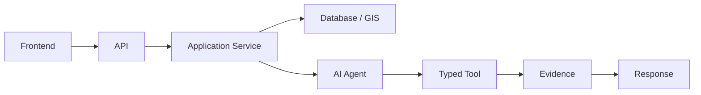

# Integration Evidence Plan

## 1. Purpose

This document defines the end-to-end evidence process across the full system trace, elaborating [integration-poc.md](../18_Evidence_and_PoC_Resolution/integration-poc.md) into an acquisition-focused plan. **No PoC has been executed. No integration outcome is claimed.**

## 2. The Full Trace

## 3. Evidence Requirements Per Trace Segment

| Segment | Evidence Required | Acquisition Approach | Current Status |
|---|---|---|---|
| Frontend → API | Authenticated, correctly routed requests | Execute [integration-poc.md](../18_Evidence_and_PoC_Resolution/integration-poc.md) Sections 4–6 | **EVIDENCE NOT AVAILABLE** |
| API → Application Service | Authorization enforced for the caller's district/role scope | Same | **EVIDENCE NOT AVAILABLE** |
| Application Service → Database/GIS | Correct data retrieval/computation with intact transaction behavior | Same | **EVIDENCE NOT AVAILABLE** |
| Application Service → AI Agent | Correct invocation with no unrestricted data-access path | Same | **EVIDENCE NOT AVAILABLE** |
| AI Agent → Typed Tool | Correct tool selection/sequencing, authorization enforced identically to ordinary requests | Same | **EVIDENCE NOT AVAILABLE** |
| Typed Tool → Evidence | Tool results correctly become Evidence items with intact provenance | Same | **EVIDENCE NOT AVAILABLE** |
| Evidence → Response | Response correctly shaped per [api-contracts.md](../06_API_and_Integration/api-contracts.md), grounded, with correct uncertainty communication | Same | **EVIDENCE NOT AVAILABLE** |

## 4. Canonical Workflow Evidence Requirements

### 4.1 Healthcare Coverage (Example A)

| Requirement | Evidence Source |
|---|---|
| Trace steps 1–6 | [integration-poc.md](../18_Evidence_and_PoC_Resolution/integration-poc.md) Section 4 |
| Current status | **EVIDENCE NOT AVAILABLE** — depends on Rows 4–7 of [implementation-unlock-matrix.md](../20_Implementation_Unlock_and_Governance/implementation-unlock-matrix.md) (frontend/backend/database/GIS technology), none resolved |

### 4.2 Bridge Closure (Example B)

| Requirement | Evidence Source |
|---|---|
| Sandbox isolation verification | [integration-poc.md](../18_Evidence_and_PoC_Resolution/integration-poc.md) Section 5 |
| Current status | **EVIDENCE NOT AVAILABLE** — same dependencies, plus Simulation Service design (complete but unexercised) |

### 4.3 Heavy Rainfall Cross-Domain Chain (Example C)

| Requirement | Evidence Source |
|---|---|
| Weather→Disaster→Transportation→Healthcare full sequencing | [integration-poc.md](../18_Evidence_and_PoC_Resolution/integration-poc.md) Section 6 |
| Current status | **EVIDENCE NOT AVAILABLE** — same dependencies, plus AI provider resolution (Row 8, unresolved) and real Weather/Disaster/Transportation/Healthcare data (Row 2, unresolved) |

## 5. Independent Subsystem Failure — The Central Integration Evidence Requirement

**This is the most safety-critical evidence this plan defines**, restated unchanged from [integration-poc.md](../18_Evidence_and_PoC_Resolution/integration-poc.md) Section 12:

### 5.1 AI Failure → Map Still Works

| Field | Detail |
|---|---|
| Requirement | With the AI Agent deliberately disabled, Workflow 1 (10 km coverage, GIS-only path) must still complete successfully |
| Evidence acquisition approach | Execute the induced-failure test in [integration-poc.md](../18_Evidence_and_PoC_Resolution/integration-poc.md) Section 12 |
| Current status | **EVIDENCE NOT AVAILABLE — no implementation exists to test against; the requirement is fully designed but wholly unverified** |

### 5.2 GIS Failure → AI Does Not Fabricate Spatial Results

| Field | Detail |
|---|---|
| Requirement | With the GIS Service deliberately disabled, an AI response to a spatial question must explicitly disclose "GIS computation unavailable" rather than inventing a coverage/accessibility claim |
| Evidence acquisition approach | Execute the induced-failure test in [integration-poc.md](../18_Evidence_and_PoC_Resolution/integration-poc.md) Section 12 |
| Current status | **EVIDENCE NOT AVAILABLE — same reasoning** |

### 5.3 Database Failure → Safe Failure

| Field | Detail |
|---|---|
| Requirement | A database connection loss produces a disclosed service-unavailable response, never a fabricated or silently-stale result |
| Evidence acquisition approach | Execute the induced-failure scenario per [incident-and-failure-management.md](../14_Testing_Security_Observability/incident-and-failure-management.md) Section 14 |
| Current status | **EVIDENCE NOT AVAILABLE — no implementation exists** |

### 5.4 External Source Failure → Provenance/Error State

| Field | Detail |
|---|---|
| Requirement | An external data-source outage produces a disclosed staleness indicator on any served data, never a silent presentation of stale data as current |
| Evidence acquisition approach | Execute the induced-failure scenario per [incident-and-failure-management.md](../14_Testing_Security_Observability/incident-and-failure-management.md) Section 14 |
| Current status | **EVIDENCE NOT AVAILABLE — no real external source is even connected (Item 1, [evidence-acquisition-plan.md](evidence-acquisition-plan.md))** |

## 6. These Two Behaviors Are Automatic Gates, Not Weighted Criteria

**A candidate combination that fails either 5.1 or 5.2 receives an automatic Fail on the entire integration evidence process**, restated unchanged from [integration-poc.md](../18_Evidence_and_PoC_Resolution/integration-poc.md) Section 12 — this is a structural safety property, not a nice-to-have that can be offset by strong performance elsewhere.

## 7. Evidence Acquisition Sequence

**This sequence cannot begin until at minimum frontend, backend, database, and GIS technology are Selected** — restated unchanged from [implementation-unlock-matrix.md](../20_Implementation_Unlock_and_Governance/implementation-unlock-matrix.md) Rows 4–7, all currently Fail.

## 8. No Integration Outcome Claimed

**This document does not claim any integration test passed, failed, or was executed.** Every trace segment and every canonical workflow reports EVIDENCE NOT AVAILABLE.

## 9. Security

Section 5 constitutes this document's core security/safety evidence requirement.

## 10. Observability

Once evidence acquisition genuinely begins, every finding is recorded per [evidence-record-management.md](evidence-record-management.md).

## 11. Milestone Traceability

| Evidence Item | First Needed |
|---|---|
| Workflow 1 (Coverage) | M1–M2 |
| Workflow 2 (Bridge Closure) | M5 |
| Workflow 3 (Rainfall Chain) | M2–M5 |
| Independent-failure tests | M3 (once AI exists to be disabled) |

## 12. Open Decisions

No integration evidence has been acquired. Every dependency (frontend, backend, database, GIS, AI technology) remains unresolved.
