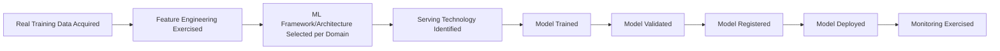

# Model Serving Evidence Plan

## 1. Purpose

This document defines the evidence required for prediction model serving, elaborating [prediction-implementation.md](../13_AI_Intelligence_Implementation/prediction-implementation.md) and [model-lifecycle-implementation.md](../13_AI_Intelligence_Implementation/model-lifecycle-implementation.md) into an acquisition-focused plan. **No model, ML framework, or serving technology is selected. No model or result is invented.**

## 2. Candidates — Restated Unchanged

| Technology | Category | Status |
|---|---|---|
| scikit-learn | ML framework | Candidate |
| Prophet / statsmodels | Time-series forecasting | Candidate |
| PyTorch / TensorFlow | Deep learning framework | To Be Evaluated |
| Model-serving technology | — | **No candidate named in any prior documentation** |

## 3. Evidence Categories and Acquisition Approach

| Category | What Evidence Would Show | Acquisition Approach | Current Status |
|---|---|---|---|
| Prediction models | A model architecture is suitable for one of the five confirmed domains (Flood, Rainfall, Population Growth, Traffic, Crop) | Requires real training data ([data-source-evidence-plan.md](data-source-evidence-plan.md)) first | **EVIDENCE NOT AVAILABLE — no real data exists to train against** |
| Model lifecycle | The full Data→Features→Training→Validation→Registration→Deployment→Monitoring chain is exercisable | Design review is complete ([model-lifecycle-implementation.md](../13_AI_Intelligence_Implementation/model-lifecycle-implementation.md)); real exercise blocked | **EVIDENCE NOT AVAILABLE for real exercise; design is Pass per [ai-and-gis-readiness-gates.md](../20_Implementation_Unlock_and_Governance/ai-and-gis-readiness-gates.md) RG-AI-008** |
| Serving architecture | A model-serving technology correctly exposes a registered model through the Prediction Service boundary | Requires a serving-technology candidate first — none exists | **EVIDENCE NOT AVAILABLE — no candidate named** |
| Feature availability | Feature engineering ([feature-engineering-implementation.md](../13_AI_Intelligence_Implementation/feature-engineering-implementation.md)) can be exercised against real Curated data | Requires real data | **EVIDENCE NOT AVAILABLE** |
| Model versioning | The registry concept ([model-lifecycle-implementation.md](../13_AI_Intelligence_Implementation/model-lifecycle-implementation.md) Section 6) is exercisable | Design complete; real exercise blocked | **EVIDENCE NOT AVAILABLE for real exercise** |
| Monitoring | Drift-detection and performance monitoring are exercisable against a live model | Requires a deployed model | **EVIDENCE NOT AVAILABLE** |
| Retraining | Retraining triggers correctly fire on validated drift | Requires a deployed model with observed drift | **EVIDENCE NOT AVAILABLE** |
| Rollback | A model version rollback correctly reverts to the prior registered version | Requires at least two registered model versions | **EVIDENCE NOT AVAILABLE** |
| Failure behavior | A prediction request against an unavailable model correctly discloses the gap rather than guessing | Execute a PoC once a serving technology and model exist | **EVIDENCE NOT AVAILABLE** |

## 4. The Prediction ≠ Simulation ≠ Recommendation ≠ AI Response Distinction — Preserved

**This document maintains the four-way distinction strictly**, restated unchanged from [simulation-and-scenario-implementation.md](../13_AI_Intelligence_Implementation/simulation-and-scenario-implementation.md) Section 2:

| Category | Meaning | This Document's Scope |
|---|---|---|
| Prediction | An expected future value/forecast from a trained model against real conditions | **In scope** — this document's subject |
| Simulation | A hypothetical changed condition | Out of scope — AD-AI-002 establishes Simulation reuses trained Prediction models rather than requiring independent training, but Simulation's own execution architecture is addressed in [integration-evidence-plan.md](integration-evidence-plan.md), not here |
| Recommendation | A proposed action derived from Evidence/Prediction/Simulation | Out of scope — addressed separately per the Recommendation scoring gap (Item 16, [evidence-acquisition-plan.md](evidence-acquisition-plan.md)) |
| AI Response | A natural-language explanation | Out of scope — never itself a model-serving concern |

**No document in this milestone collapses these four categories.**

## 5. No Model or Result Invented

**This document does not invent a model architecture, a training result, a benchmark score, or an accuracy figure for any Prediction domain.** Every row in Section 3 reports EVIDENCE NOT AVAILABLE precisely because no real training data (Item 1, [evidence-acquisition-plan.md](evidence-acquisition-plan.md)) exists to train against.

## 6. The Healthcare Demand Contradiction — Not Addressed Here

Restated unchanged from [prediction-implementation.md](../13_AI_Intelligence_Implementation/prediction-implementation.md) Section 14: this document's evidence plan applies uniformly to the five Blueprint-confirmed domains. Healthcare Demand's scope contradiction is not addressed by this document — it requires the separate scope-clarification decision named in [evidence-acquisition-plan.md](evidence-acquisition-plan.md) Section 4.15, not a model-serving evidence exercise.

## 7. Evidence Acquisition Sequence

**This entire sequence is blocked at its very first step — no real training data exists.** Nothing beyond design review has occurred for any stage.

## 8. No Technology Selected

**This document selects no ML framework, model architecture, or serving technology.** scikit-learn and Prophet/statsmodels remain Candidate; PyTorch/TensorFlow remains To Be Evaluated; no serving-technology candidate exists at all.

## 9. Security

Model serving evidence must confirm no model artifact or raw training data is exposed outside the Prediction Service boundary — restated unchanged from [typed-tool-implementation.md](../13_AI_Intelligence_Implementation/typed-tool-implementation.md) Section 8.3, untested pending real deployment.

## 10. Observability

Once evidence acquisition genuinely begins, every finding is recorded per [evidence-record-management.md](evidence-record-management.md).

## 11. Milestone Traceability

| Evidence Item | First Needed |
|---|---|
| Model serving resolution | M4 |

## 12. Open Decisions

No model, ML framework, or serving technology is selected. All evidence categories in Section 3 report EVIDENCE NOT AVAILABLE, blocked at the root by the absence of real training data.
