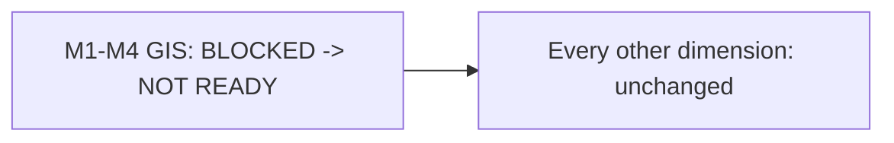

# Implementation Readiness Reassessment

## 1. Purpose

This document reassesses [milestone-readiness-matrix.md](../16_Engineering_Readiness_and_Baseline/milestone-readiness-matrix.md)'s M1–M6 ratings against this milestone's baseline-promotion findings ([baseline-promotion-register.md](baseline-promotion-register.md)). **Evidence progress does not automatically equal implementation readiness — every rating change below is justified individually; every rating left unchanged is left unchanged deliberately, not by oversight.**

## 2. Rating Legend — Unchanged

Restated exactly from [milestone-readiness-matrix.md](../16_Engineering_Readiness_and_Baseline/milestone-readiness-matrix.md) Section 2: READY, PARTIALLY READY, NOT READY, BLOCKED, UNRESOLVED.

## 3. M1 — Digital Twin Foundation

| Dimension | Prior Rating | New Rating | Justification |
|---|---|---|---|
| Requirements | READY | READY | No change — unaffected by this milestone |
| Architecture | PARTIALLY READY | PARTIALLY READY | No change — no technology reached Selected |
| Data | NOT READY | NOT READY (unchanged) | No domain reached ACCEPT; however, unlike the prior state, healthcare, roads, and education domains now have substantive PoC-level evidence rather than none — this is noted as an evidentiary improvement without changing the rating, since ACCEPT is still the actual bar for NOT READY→PARTIALLY READY |
| GIS | **BLOCKED** | **NOT READY** | **Changed.** BLOCKED specifically meant "cannot even be attempted until an upstream dependency resolves" — that was true when no boundary candidate existed at all. A specific, strong, PASS-level candidate (Candidate B) now exists with real evidence; the remaining gap is five named, addressable gates (licensing, full geometry validity, topology, explicit CRS, direct provenance), not a total absence of a starting point. This is a narrow, deliberately conservative upgrade — not to PARTIALLY READY, since none of those five gates has actually closed |
| Backend | PARTIALLY READY | PARTIALLY READY | No change |
| Frontend | PARTIALLY READY | PARTIALLY READY | No change — Node.js availability (VAL-M6-P3-024) is a minor positive environmental fact, not a technology decision |
| AI | Not applicable to M1 | Not applicable to M1 | Unchanged |
| Testing | NOT READY | NOT READY | No change — zero test suite exists |
| Security | PARTIALLY READY | PARTIALLY READY | No change |
| Deployment | NOT READY | NOT READY | No change |
| Operational | NOT READY | NOT READY | No change |

## 4. M2 — District Intelligence

| Dimension | Prior Rating | New Rating | Justification |
|---|---|---|---|
| Requirements | READY | READY | No change |
| Architecture | PARTIALLY READY | PARTIALLY READY | No change |
| Data | NOT READY | NOT READY | No change — inherits M1; source-precedence calibration (Item 25) gained real evidentiary substance (two genuine fragmentation instances, [data-provenance-and-fragmentation-validation.md](../24_Evidence_Deep_Validation_and_PoC/data-provenance-and-fragmentation-validation.md)) but **no precedence rule was finalized** — [RG-DATA-008](../20_Implementation_Unlock_and_Governance/data-readiness-gates.md)'s Pass condition ("a precedence rule exists with documented evidentiary basis") is still not met, only its prerequisite evidence-gathering has genuinely begun |
| GIS | **BLOCKED** | **NOT READY** | Inherits M1's change (Section 3) |
| Backend | PARTIALLY READY | PARTIALLY READY | No change |
| Frontend | PARTIALLY READY | PARTIALLY READY | No change |
| AI | Not applicable to M2 | Not applicable to M2 | Unchanged |
| Testing | NOT READY | NOT READY | No change |
| Security | PARTIALLY READY | PARTIALLY READY | No change |
| Deployment | NOT READY | NOT READY | No change |
| Operational | NOT READY | NOT READY | No change |

## 5. M3 — Grounded Agentic AI

| Dimension | Prior Rating | New Rating | Justification |
|---|---|---|---|
| Requirements | READY | READY | No change |
| Architecture | PARTIALLY READY | PARTIALLY READY | No change |
| Data | NOT READY | NOT READY | Inherits M1–M2 |
| GIS | **BLOCKED** | **NOT READY** | Inherits M1's change |
| Backend | PARTIALLY READY | PARTIALLY READY | No change |
| Frontend | PARTIALLY READY | PARTIALLY READY | No change |
| AI | **UNRESOLVED** | **UNRESOLVED (unchanged)** | The AI provider divergence is a governance question ([RG-AI-001](../20_Implementation_Unlock_and_Governance/ai-and-gis-readiness-gates.md)), not a feasibility question — real local-LLM feasibility evidence (VAL-M6-P3-026 through 030) does not resolve a governance question, restated explicitly in [ai-rag-and-serving-decision.md](ai-rag-and-serving-decision.md) Section 4. Rating deliberately left UNRESOLVED, not advanced to BLOCKED or PARTIALLY READY |
| Testing | NOT READY | NOT READY | No change |
| Security | PARTIALLY READY | PARTIALLY READY | No change |
| Deployment | NOT READY | NOT READY | No change |
| Operational | NOT READY | NOT READY | No change |

## 6. M4 — Predictive Intelligence

| Dimension | Prior Rating | New Rating | Justification |
|---|---|---|---|
| Requirements | READY (partial) | READY (partial) | No change |
| Architecture | PARTIALLY READY | PARTIALLY READY | No change |
| Data | NOT READY | NOT READY | No change |
| GIS | **BLOCKED** | **NOT READY** | Inherits M1's change |
| Backend | PARTIALLY READY | PARTIALLY READY | No change |
| Frontend | PARTIALLY READY | PARTIALLY READY | No change |
| AI | BLOCKED | BLOCKED | No change — inherits M3's AI provider blocker; ML framework/model-serving (Items 10–11) remain fully unresolved, no new evidence gathered this milestone |
| Testing | NOT READY | NOT READY | No change |
| Security | PARTIALLY READY | PARTIALLY READY | No change |
| Deployment | NOT READY | NOT READY | No change |
| Operational | NOT READY | NOT READY | No change |
| **Healthcare Demand gap (Item 26)** | UNRESOLVED | **UNRESOLVED (unchanged)** | No evidence gathered this program addresses the Prediction-scope contradiction itself — restated explicitly in [decision-review-record.md](decision-review-record.md) Section 19 |

## 7. M5 — Scenario Simulation & Recommendations (Simulation Portion)

| Dimension | Prior Rating | New Rating | Justification |
|---|---|---|---|
| All dimensions | (as previously rated) | **Unchanged** | Simulation reuses trained Prediction models (AD-AI-002) and therefore inherits every M4 blocker unchanged; this milestone gathered no Simulation-specific evidence |

## 8. M6 — Advanced Agentic District Intelligence (Recommendation Portion)

| Dimension | Prior Rating | New Rating | Justification |
|---|---|---|---|
| All dimensions | (as previously rated) | **Unchanged** | Inherits M1–M5 unchanged |
| **Recommendation scoring gap (Item 27)** | UNRESOLVED | **UNRESOLVED (unchanged)** | No technique decision or real-outcome-data weight calibration was performed this milestone — restated explicitly in [decision-review-record.md](decision-review-record.md) Section 20 |

## 9. Consolidated View — What Actually Moved

**Exactly one rating changed across the entire M1–M6 matrix this milestone: the GIS dimension, from BLOCKED to NOT READY, across every milestone that inherits it (M1 through M4; M5–M6 inherit it unchanged in substance since they were already rated relative to M4's chain).** Every other dimension — including Data, AI, and the two named contradictions (Healthcare Demand, Recommendation scoring) — remains exactly as previously rated, because this milestone's evidence, while substantial, did not cross the specific bar ([RG-*] Pass conditions, ACCEPT decisions, governance resolutions) each of those ratings actually requires.

## 10. Why This Is the Correct, Conservative Call

Per this milestone's own governing instruction: **"Evidence progress does not automatically equal implementation readiness."** The GIS rating change from BLOCKED to NOT READY reflects a narrow, specific fact — a candidate now exists where none did before, so the dimension is no longer "cannot even be attempted" — without claiming any gate has actually Passed. Every other rating is left untouched precisely because the corresponding gate's Pass condition (per [readiness-gate-framework.md](../20_Implementation_Unlock_and_Governance/readiness-gate-framework.md) Section 4) genuinely remains unmet.

## 11. Security

No rating is advanced in a way that would imply a security-relevant gate (AI-exclusion, GIS server-side authority) has been validated — none has.

## 12. Observability

Every rating change traces to [baseline-promotion-register.md](baseline-promotion-register.md) and the underlying decision files; every unchanged rating is explicitly justified as unchanged, not silently carried forward.

## 13. Milestone Traceability

This reassessment directly feeds [ED-M6-P4-VALIDATION.md](ED-M6-P4-VALIDATION.md) Item 35 (M1–M6 readiness) and any future [milestone-readiness-matrix.md](../16_Engineering_Readiness_and_Baseline/milestone-readiness-matrix.md) update (not performed by this document itself, per the read-only/no-application-code scope of this milestone).

## 14. Open Decisions

**No milestone is READY.** M1 remains the closest to unblockable through pure technology decisions but is still hard-blocked on Data (Item 1) and GIS (now NOT READY, not yet PARTIALLY READY). M3, M4, and M6 each still carry their own genuine UNRESOLVED contradiction, none closed by this milestone.
