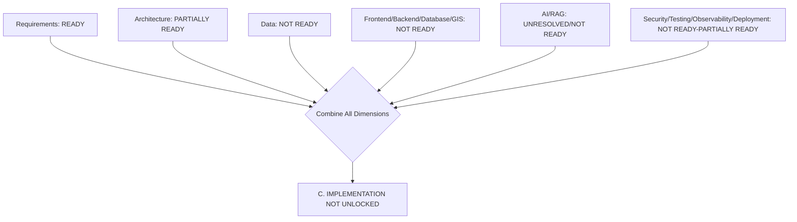

# Implementation Transition and Unlock Assessment

## 1. Purpose

**This is the most important document in this milestone.** It determines whether — and to what extent — DistrictMind implementation may begin. It does not optimize for a positive answer. It reports the answer the evidence and governance record actually support.

## 2. Dimension-by-Dimension Assessment

| Dimension | Rating | Justification |
|---|---|---|
| Requirements | **READY** (Conditional) | RG-REQ-001–008 mostly Pass; 4 named traceability gaps remain, none blocking |
| Architecture | **PARTIALLY READY** | Every invariant Pass at design-consistency level (RG-ARCH-001–008); zero implementation exists to verify against |
| Data | **NOT READY** | No domain reaches ACCEPT; boundary/healthcare/roads/education have real, substantial PoC-level evidence, materially stronger than before, but the ACCEPT bar is unmet everywhere |
| Boundary dataset | **NOT READY** | Strongest single candidate in the program (RECOMMENDED — PENDING FORMAL APPROVAL); 5 named gates (licensing, geometry validity/topology, CRS, provenance) remain open |
| Healthcare | **NOT READY** | OSM (scoped) and NIC (remediation required) both RECOMMENDED-class; neither reaches ACCEPT |
| GIS | **NOT READY** | Algorithm logic PASS; PostGIS itself entirely BLOCKED; moved from BLOCKED to NOT READY in ED-M6 Part 4, unchanged since |
| Frontend | **NOT READY** | RG-TECH-001 Fail — zero framework PoC executed; Node.js availability is a minor environmental fact only |
| Backend | **NOT READY** | RG-TECH-002 Fail — zero framework PoC executed |
| Database | **NOT READY** | RG-TECH-003 Fail — no PostgreSQL instance available anywhere in this program; Candidate/Proposed documentation divergence unresolved |
| AI | **UNRESOLVED** | RG-AI-001 Fail — the provider divergence is a governance question, not a feasibility question; real local-LLM feasibility evidence does not resolve it |
| RAG | **NOT READY** | RG-TECH-006/007/008 Fail — no embedding model, no retrieval pipeline, only a proxy-level grounded-generation test |
| Security | **PARTIALLY READY** | RG-SEC-001–012 mostly Pass at design level; authentication provider, secrets tooling, and observability platform all Fail |
| Testing | **NOT READY** | Design complete (RG-SEC-008); zero test executed against real application code |
| Observability | **NOT READY** | Design complete; platform unresolved; nothing instrumented |
| Deployment | **NOT READY** | Design complete (RG-DEPLOY-001–009); hosting/secrets/monitoring all unresolved; RPO/RTO unresolved |
| Governance | **PARTIALLY READY** | The decision-governance framework itself is mature and has now been genuinely exercised twice (ED-M6 Part 4, this milestone) against real evidence; zero decision has completed the full path to Baseline Entry |

## 3. Final Determination

## **C. IMPLEMENTATION NOT UNLOCKED**

**DistrictMind implementation is NOT UNLOCKED, for either partial or full scope.** This determination follows directly and necessarily from Section 2: of 16 assessed dimensions, 10 are NOT READY, 1 is UNRESOLVED, 4 are PARTIALLY READY, and only 1 (Requirements) reaches READY. Every CRITICAL blocker in [implementation-blockers-final-state.md](implementation-blockers-final-state.md) Section 2 remains open. No candidate technology has reached Selected. No dataset has reached ACCEPT. Zero decisions have been formally closed. Zero baselines have been approved.

### Why Not B (Partially Unlocked)

A partial unlock would require at least one dimension to cross from "evidence exists" to "formally decided, baselined, and governance-approved for use." **No dimension crosses that line.** The boundary dataset — the closest candidate to that line anywhere in this program — still carries 5 explicitly unmet gates, including completely unverified licensing. Using it for anything beyond further evidence-gathering, before licensing is confirmed, would itself violate this milestone's Absolute Rule against converting a recommendation into a decision without governance approval.

### Why Not A (Fully Unlocked)

Not remotely close. Zero of 13 technology categories reaches Confirmed or Selected. No frontend, backend, or database technology has even completed a PoC.

## 4. Controlled Validation Vertical Slice — Assessed and Not Justified

Per this milestone's Section 18, a narrow read-only map-rendering slice (validated boundary candidate only, synthetic/labeled data, no production claims) was explicitly considered.

| Requirement for the Slice | Actually Met? |
|---|---|
| A validated boundary candidate exists | Partially — strong PoC evidence exists, but licensing is completely unverified |
| A rendering technology with at least some PoC evidence | **No** — zero frontend/rendering technology has completed any PoC; only Node.js's bare runtime presence is confirmed, not React, not Leaflet, not any rendering path |
| No irreversible architecture decisions | Achievable in principle |
| No production deployment | Achievable in principle |

**This document does not authorize the example slice.** Two independent reasons, either one sufficient on its own:

1. **Licensing is completely unverified for the only strong boundary candidate.** Rendering or displaying this data — even locally, even as a labeled prototype — before licensing is confirmed is a real compliance risk, not a hypothetical one. The boundary dataset's own requirements document ([district-boundary-dataset-requirements.md](../17_Data_and_Technology_Resolution/district-boundary-dataset-requirements.md) Section 11) explicitly requires a license permitting "re-serving simplified/derived geometry to the frontend for rendering" — precisely the capability a rendering slice would exercise, and precisely the one gate never checked.
2. **Zero rendering/frontend technology has any PoC evidence.** Picking one now, even for a throwaway prototype, would mean making a technology choice with no Evidence, PoC, or Decision stage behind it — exactly what this milestone's Absolute Rules forbid ("DO NOT convert recommendations into formal decisions without evidence and governance approval").

### **NO IMPLEMENTATION SCOPE UNLOCKED.**

### What Remains Legitimate — Explicitly Distinguished From "Unlocked Implementation"

**Further local, ephemeral, non-persisted, non-rendered algorithmic validation — of the kind already performed in ED-M6 Part 3 (point-in-polygon, distance, bounding-box computation against the candidate boundary data) — is not gated by this determination**, because it was never implementation to begin with; it is evidence-gathering, explicitly scoped as such, producing no rendered output, no persisted data, no deployed artifact, and no redistribution of the underlying geometry. This document does not authorize a *new* activity — it clarifies that continuing the *existing* evidence/validation pattern remains appropriate, while any activity that renders, persists, deploys, or redistributes data is not.

## 5. M1–M6 Final Readiness Matrix

| Milestone | Documentation | Evidence | PoC | Decision | Baseline | Implementation Readiness | Unlock Status |
|---|---|---|---|---|---|---|---|
| **M1 — Digital Twin Foundation** | Complete | Substantial (boundary, healthcare, roads, education) | Multiple real PoCs executed (GIS algorithms, Node.js check) | 0 formally closed | 0 approved | **NOT READY** — GIS NOT READY (was BLOCKED); Data NOT READY; Frontend/Backend/Database NOT READY | **NOT UNLOCKED** |
| **M2 — District Intelligence** | Complete | Inherits M1; fragmentation evidence (2 real instances) | Inherits M1 | 0 formally closed | 0 approved | **NOT READY** — inherits M1; source-precedence calibration evidence exists, no rule finalized | **NOT UNLOCKED** |
| **M3 — Grounded Agentic AI** | Complete | Real local-LLM evidence (4 tests) | TEST EXECUTED — PASS/PARTIAL | 0 formally closed | 0 approved | **UNRESOLVED** (AI provider divergence) | **NOT UNLOCKED** |
| **M4 — Predictive Intelligence** | Complete | None specific to Prediction domains | Not tested | 0 formally closed | 0 approved | **BLOCKED** — inherits M1–M3; Healthcare Demand gap unchanged | **NOT UNLOCKED** |
| **M5 — Scenario Simulation & Recommendations (Simulation)** | Complete | None new | Not tested | 0 formally closed | 0 approved | **BLOCKED** — inherits M4 per AD-AI-002's model-reuse dependency | **NOT UNLOCKED** |
| **M6 — Advanced Agentic District Intelligence (Recommendation)** | Complete | None new | Not tested | 0 formally closed | 0 approved | **BLOCKED** — inherits M1–M5; Recommendation scoring gap unchanged | **NOT UNLOCKED** |

**No M-level implementation is complete, in progress, or unlocked. Every milestone remains at the documentation/evidence stage.**

## 6. What Would Change This Determination

| Change | Effect |
|---|---|
| Boundary dataset's 5 gates closed + formal Decision Review + approval | Would move GIS/Data toward PARTIALLY READY for the boundary-specific scope only — still would not by itself unlock frontend/backend/database |
| At least one frontend AND one backend technology completes Evidence+PoC+Decision | Would be the first technology-category unlock in the program |
| A real PostgreSQL instance is provisioned and PoC-tested | Would resolve BLK-005/BLK-006's environment-blocked status |
| AI-provider governance question is explicitly decided | Would resolve the AI dimension from UNRESOLVED to a rated status |
| An authentication provider and secrets tooling reach Selected | Would move Security from PARTIALLY READY toward READY |

**None of these has occurred. This document does not anticipate them occurring — it reports the state as it actually stands.**

## 7. Security

This determination does not weaken, bypass, or reinterpret any security boundary to produce a more favorable unlock outcome.

## 8. Observability

Every rating in Section 2 traces to a specific `RG-*` gate or ED-M6 Part 3/4/5 finding, enumerated across [requirements-final-state.md](requirements-final-state.md) through [implementation-blockers-final-state.md](implementation-blockers-final-state.md).

## 9. Milestone Traceability

This assessment is the terminal readiness judgment for the entire M1–M6 program.

## 10. Open Decisions

**IMPLEMENTATION NOT UNLOCKED. NO IMPLEMENTATION SCOPE UNLOCKED — not even a controlled validation vertical slice.** Every blocker in [implementation-blockers-final-state.md](implementation-blockers-final-state.md) remains open. This determination is not appealed, softened, or partially reversed anywhere else in this milestone's 15 files.
